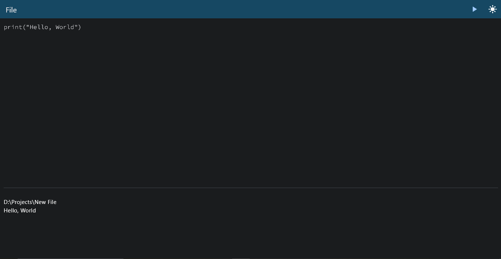

# Hariri


Hariri is a Python code editor written in Flet

# Video demo
<video width="320" height="240" src="demo_vid.mp4" alt="demo video">

## Requirements: 
```python
pip install flet
```
```python
pip install autopep8
```
## Screenshots from the editor

### Dark Mode



### Light Mode


## Usage

## Contributions

Feel free to pull a request
