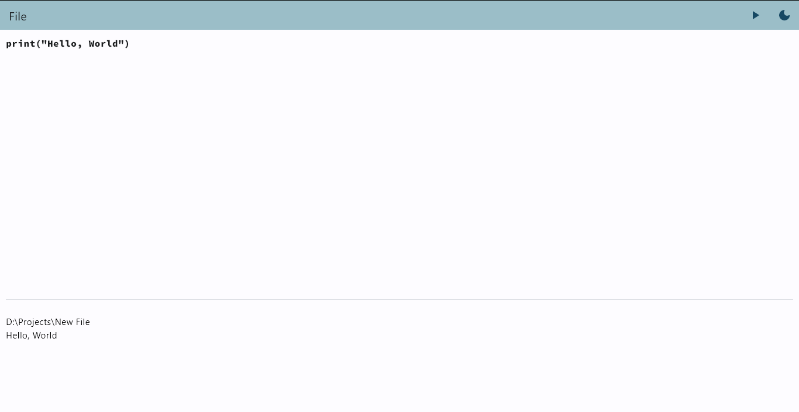

# Hariri


Hariri is a Python code editor written in Flet

# Video demo


## Requirements: 
```python
pip install flet
```
```python
pip install autopep8
```
## Screenshots from the editor

### Dark Mode


### Light Mode




## Usage

## Contributions

Feel free to pull a request
